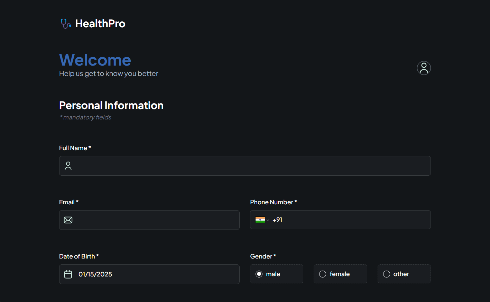
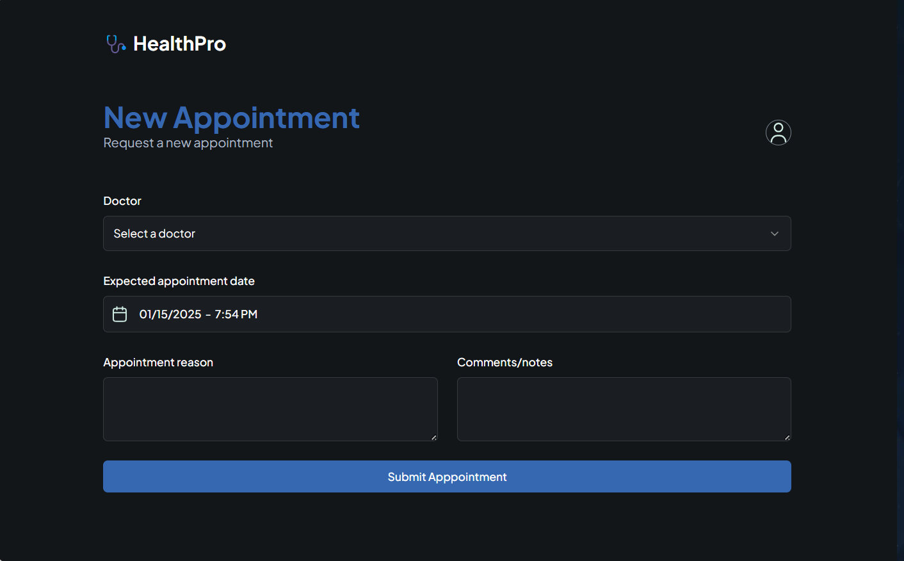
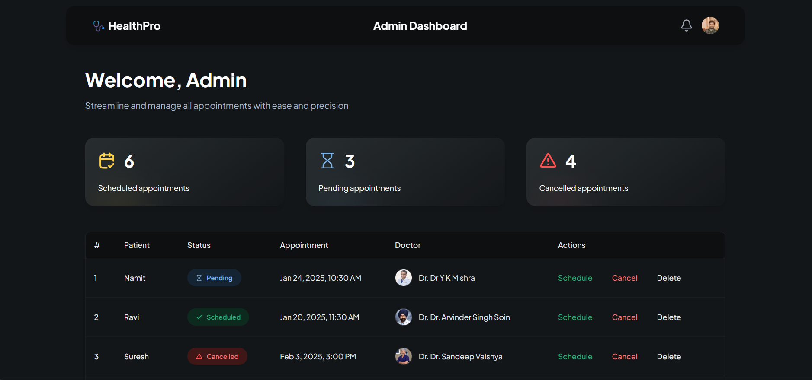

# HealthPro

### Introduction

Managing healthcare appointments can often be tedious and unorganized. HealthPro is a comprehensive healthcare management system designed to simplify the process of booking appointments with your preferred doctor. With just a few simple steps, users can register, book, view, and edit their appointments seamlessly.

### Features

- **User-Friendly Appointment Booking**: Book appointments with your preferred doctor at a convenient date and time.
- **Hassle-Free Management**: View, edit, or cancel appointments effortlessly.
- **Admin Panel**:
  - Schedule, reschedule, or delete any appointment.
  - Adjust appointment timings based on availability.
  - Manage user bookings efficiently.
- **Seamless Integration**: Powered by modern technologies to ensure a smooth user experience.

---

## How It Works

1. **User Registration**: Users need to first log in to their accounts.
2. **Basic Information**: Provide the basic personal information.
3. **Appointment Booking**: Select a doctor, preferred date-time slot and confirm the booking.
4. **Admin Panel**: Manage bookings, reschedule, or cancel appointments as needed.

---

## Tech Stack

### Frontend

- **React.js**: Component-based UI development.
- **TypeScript**: For type-safe JavaScript.
- **Next.js**: Server-side rendering and routing.
- **Tailwind CSS**: Utility-first CSS framework for styling.
- **ShadCN**: Pre-built components to enhance UI.

### Backend

- **Node.js**: Server-side runtime.
- **Appwrite**: Backend-as-a-Service for authentication and database management.

### Other Integrations

- **Twilio**: For SMS notifications.

      

---

## Screenshots

_**HealthPro Homepage**_

_**User Details Page**_

_**New Appointment Page**_

_**Admin Page**_

---

## Future Enhancements

This project is actively being developed, with potential upcoming features like:

- **AI-Powered Doctor Suggestions**: Recommend doctors based on user symptoms and preferences.
- **Health Records Management**: Allow users to upload and manage their medical records securely.
- **Multi-Language Support**: Provide accessibility for users speaking different languages.

---

## Contributing

We welcome contributions to make HealthPro even better! Please follow these steps:

1. Fork the repository.
2. Create a new branch for your feature or bug fix.
3. Commit your changes and push the branch.
4. Open a pull request for review.

---

## Acknowledgments

This project is inspired by the innovative work of Adrian at [JavaScript Mastery
](https://www.youtube.com/@javascriptmastery).Thank you for your guidance.
